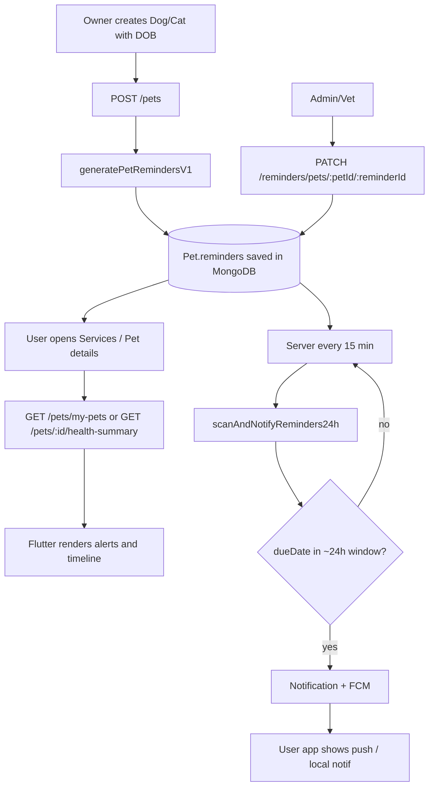

# Vaccination & health reminders — how it works

This document describes the **vaccination-related reminder system** as implemented today: data lives mostly on the **backend** (`Pet.reminders` + optional vaccination fields). The **user app** loads that data over the API and shows alerts in a few screens; **push** for “due soon” style reminders is produced by a **server job**, not by Flutter scheduling.

---

## 1. Where reminder data is stored

- **MongoDB `pets` documents** include an embedded array: `reminders[]`.
- Each reminder is a subdocument with (among others):
  - **`category`**: `vaccination` | `deworming` | `flea_tick` | `checkup`
  - **`title`**, **`dueDate`**
  - **`status`**: `upcoming` (default) | `completed` | `skipped`
  - **`called`** / **`calledAt`** (call tracking)
  - Optional **due-date overrides** (`originalDueDate`, `overriddenDueDate`, `overrideReason`, …)
  - **`engine`**: `{ version: 'v1', ruleId }` — ties rows back to `reminderEngine.js` rules

Separately, the pet may have owner-facing fields such as **`vaccinationStatus`** and **`nextVaccinationDate`**. The user app uses those **together with** `reminders` to decide what to show as “overdue” / “due soon” in some places.

---

## 2. How reminders get created or updated (backend)

### Initial generation (primary path)

When an owner **creates a pet** via `POST /api/v1/pets`:

- If **`dob`** is set and **`species`** is Dog or Cat (case variants allowed), the API runs **`generatePetRemindersV1`** (`backend/src/utils/reminderEngine.js`) and saves the returned list into **`pet.reminders`**.
- The engine builds a **concrete schedule** from date of birth, e.g. for dogs/cats:
  - Core series (e.g. DHPP/FVRCP doses at 6 / 10 / 14 weeks, rabies ~16 weeks)
  - **Annual boosters** generated up to a **time horizon** (default 24 months ahead)
  - Additional rules for deworming, flea/tick (outdoor pets get higher priority / shorter intervals), checkups, etc.

If **species is not dog/cat** or **dob is missing**, **`reminders` is stored as an empty array** at create time.

### After create: manual fields vs embedded reminders

- **`PUT /api/v1/pets/:id`** (owner update) can change `vaccinationStatus`, `nextVaccinationDate`, `dob`, etc. **It does not automatically re-run `generatePetRemindersV1`** today. So changing DOB later **does not** by itself rebuild the `reminders[]` timeline unless something else writes them.

### Staff / admin changes to a single reminder

- **`PATCH /api/v1/reminders/pets/:petId/:reminderId`** (authorized **admin** or **veterinarian**) updates one reminder: mark **called** / **completed**, **skip**, or **override due date** (`backend/src/controllers/reminderController.js`).

### Admin visibility (ops / desk)

- **`GET /api/v1/reminders/admin/today`** — upcoming reminders due **today** (UTC day window).
- **`GET /api/v1/reminders/admin/upcoming?days=7`** — rolling window for planning.

---

## 3. Push & in-app “24h before due” notifications (backend)

**File:** `backend/src/utils/reminderNotifier.js`  
**Entry:** `scanAndNotifyReminders24h()`

- Queries all pets, **unwinds** `reminders`, and selects rows where:
  - `reminders.status === 'upcoming'`
  - `reminders.dueDate` falls in a **time window**: approximately **24 hours from “now”**, with a **60-minute** width (implementation uses `hoursFromNowStart: 24` and `windowMinutes: 60`).
- For each match it:
  1. Creates a **`Notification`** document (`type: 'reminder'`, links `reminderPet`, `reminderId`, `reminderDueDate`).
  2. Sends **FCM** to the owner’s registered device tokens (if Firebase is configured).

**Deduplication:** a **unique compound index** on the `Notification` model prevents duplicate notifications for the same user + reminder + due date (duplicate key errors are swallowed / logged).

**Scheduler:** in `backend/src/server.js`, unless `ENABLE_REMINDER_NOTIFIER=false`:

- First run about **15 seconds** after the server starts (with DB connected).
- Then every **15 minutes** (`setInterval`).

So: **the user app does not schedule these pushes locally**; it only needs a valid **FCM token** registered with the API after login (`PushNotificationService`).

---

## 4. User app (`apps/mobile/user_app`) — display flow

The Flutter app is largely **read-only** for the reminder timeline: it **fetches** pet payloads that already include `reminders` (and optional vaccination summary fields) and **renders** + **combines** rules client-side for banners.

### 4.1 Services hub (`lib/screens/services/services_screen.dart`)

On load it calls **`getMyPets()`** (and service requests / linked vets). It builds **`_HealthAlert`** entries by scanning each pet:

- **`vaccinationStatus`** / **`nextVaccinationDate`**: treats as overdue if status is `Overdue`, or if the next date is not after “today” and status is not `Up to date`.
- **`reminders`**: for each item with **`category == 'vaccination'`**, **`status != 'completed'`**, and **`dueDate` in the past** (strictly before `DateTime.now()`), adds an overdue-style alert with relative copy (“N days ago”).

These alerts drive the **“Urgent health”** style UI on the Services tab (not a background isolate timer).

### 4.2 Pet profile / details (`lib/screens/pet_details_screen.dart`)

- Loads **`GET /api/v1/pets/:id/health-summary`** via `PetService.getPetHealthSummary` (full pet-shaped payload including **`reminders`**).
- Shows vaccination card from summary fields, a **health timeline** from `reminders`, and a bottom sheet of **upcoming tasks** derived from the same `reminders` list (status chips: upcoming / called / completed, priority, due date).

### 4.3 Push presentation (`lib/services/push_notification_service.dart`)

- Initializes Firebase + requests notification permission.
- Registers the FCM token with the backend when logged in.
- **Foreground** FCM: shows a **local notification** on channel **`pawsewa_reminders`** (“Health reminders” — described in code as pet vaccination and care reminders). There is **no separate parsing** of `data.type === 'reminder'` in this file beyond displaying title/body; deep-linking would be a future enhancement if desired.

**Background** messages use the standard top-level `firebaseMessagingBackgroundHandler` (logging only in debug).

---

## 5. End-to-end flow (concise)

---

## 6. Practical implications

| Question | Answer (current behavior) |
|----------|---------------------------|
| Does the phone compute vaccine due dates offline? | **No** — schedule is on the server in `Pet.reminders`; the app computes **display-only** “overdue” alerts from fetched JSON. |
| When is the timeline first created? | **Pet create** (Dog/Cat + DOB). |
| If I change DOB later, do reminders auto-update? | **Not automatically** via owner `PUT /pets` today. |
| Who can mark a dose completed or move a due date? | **Admin / veterinarian** via reminder PATCH. |
| When does the owner get a push? | When the **notifier** finds an **upcoming** reminder whose **dueDate** hits the **~24h-ahead** window and FCM is configured. |

---

## 7. Key files (reference)

| Layer | Path |
|-------|------|
| Reminder rules | `backend/src/utils/reminderEngine.js` |
| 24h scan + FCM | `backend/src/utils/reminderNotifier.js` |
| Notifier schedule | `backend/src/server.js` (search `scanAndNotifyReminders24h`) |
| Create pet → engine | `backend/src/controllers/petController.js` (`createPet`) |
| Pet schema | `backend/src/models/Pet.js` (`reminderSchema`) |
| Notification dedupe | `backend/src/models/Notification.js` |
| Admin list / PATCH | `backend/src/controllers/reminderController.js`, `backend/src/routes/reminderRoutes.js` |
| Home alerts (API) | `backend/src/controllers/homeDashboardController.js` |
| Services tab alerts | `apps/mobile/user_app/lib/screens/services/services_screen.dart` |
| Pet details + timeline | `apps/mobile/user_app/lib/screens/pet_details_screen.dart` |
| FCM + local channel | `apps/mobile/user_app/lib/services/push_notification_service.dart` |

This matches the codebase as of the last review for this document; if you add “regenerate reminders on DOB change” or deep links from FCM `data`, update this file accordingly.
